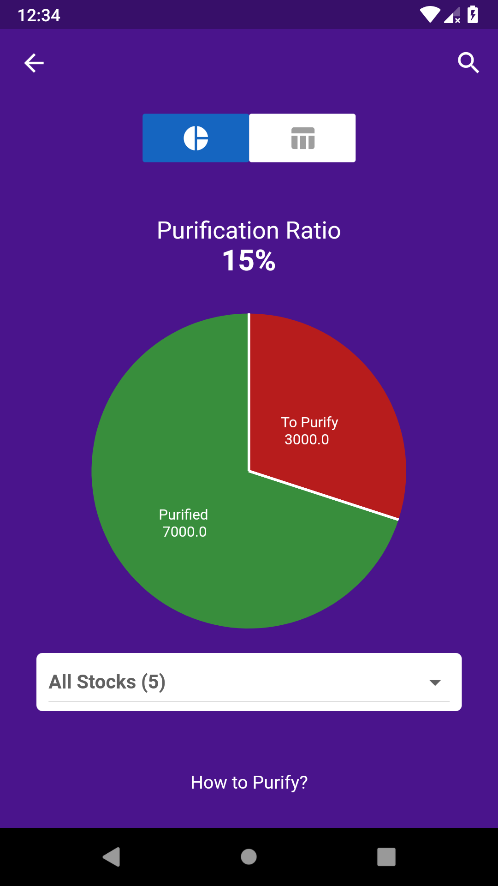

# first_screen_master

First Screen with Pie Chart of an Example App

Major UI Rendering is in lib/first_screen.dart ,

Check the code for Pie Chart in lib/chart/simple_pie_chart.dart

Screenshot :

